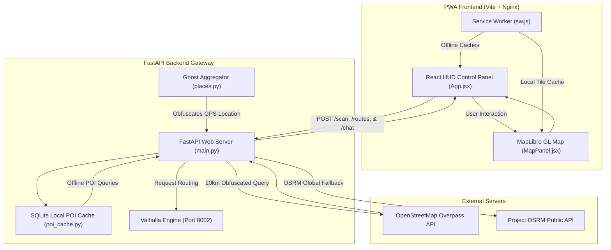

# ARES RECON SYSTEM (Augmented Recon & Environment System)

Ares Recon is a privacy-first, tactical, and offline-capable GPS navigation console. It leverages a hybrid routing architecture (offline local Valhalla routing with online global OSRM fallback), implements spatial cloaking (Ghost Aggregator) to mask location data from public APIs, tracks monitored infrastructure (surveillance overlay), and deploys as an offline-first Progressive Web App (PWA) with a dual-sidebar glassmorphic HUD.

This repository serves as an educational codebase for developers to learn about offline-first map rendering, spatial obfuscation, service worker cache management, and multi-tier docker orchestration.

---

## Core System Architecture



---

## Directory Structure

```text
├── backend/                # Python FastAPI server
│   ├── app/
│   │   ├── core/           # Configuration and settings
│   │   ├── routes/         # FastAPI route controllers (scan, routing, ai)
│   │   ├── schemas/        # Pydantic data schemas
│   │   ├── services/       # Core backend business logic
│   │   │   ├── ai.py       # OpenAI summary and chat assistants
│   │   │   ├── places.py   # Overpass/OSM parsing & Ghost Aggregator
│   │   │   ├── routing.py  # Valhalla & OSRM API routing wrappers
│   │   │   └── poi_cache.py# SQLite POI local offline database cache
│   │   └── main.py         # App entrypoint & lifespans
│   └── Dockerfile          # Production backend environment
├── frontend/               # React + Vite client dashboard
│   ├── public/             # Static public files (PWA manifest, sw.js)
│   ├── src/
│   │   ├── components/     # React visual HUD parts (MapPanel.jsx)
│   │   ├── lib/            # API communication wrapper (api.js)
│   │   ├── App.jsx         # Symmetrical HUD panel, chat, and controls
│   │   └── styles.css      # Custom dark-mode glassmorphic HUD styling
│   └── Dockerfile          # Multi-stage production build (Vite + Nginx)
├── custom_files/           # Host directory mapped to Valhalla for OSM tiles
│   └── monaco-latest.osm.pbf # Monaco GIS map data (downloaded automatically)
├── docker-compose.yml      # Orchestrates Backend, Frontend, and Valhalla
├── run.bat                 # One-click Windows startup file
├── setup_valhalla.sh       # Script for downloading OSM data
└── setup_osrm.sh           # Script for online fallback OSRM routing
```

---

## Technical Feature Explanations

### 1. Hybrid Road-Following Routing
Instead of requiring massive multi-gigabyte routing files (which are impossible to run offline on mobile devices), Ares Recon uses a hybrid routing module (`routing.py`):
* **Offline-First (Valhalla):** If navigating within the loaded offline tile bounds (**Monaco**), the backend utilizes local **Valhalla** containers to calculate road paths.
* **Online Fallback (Project OSRM):** If you route outside Monaco (e.g., France, Mumbai, or anywhere else on Earth), the backend automatically intercepts Valhalla out-of-bounds error responses (400 Client Error) and routes the points to OSRM's global road API.
* **Visualization:** The map successfully draws both the **Dashed Blue (Shortest)** and **Solid Red (Main Highway)** paths along the actual street coordinates.

### 2. Symmetrical HUD Layout & Navigation
* The left-hand panel remains static, presenting continuous access to the **System Console**, **Intent Assistant** queries, and **POI Intel** markers.
* Tapping **[ Start Navigation ]** triggers a clean, matching glassmorphic sliding panel on the **right-hand side** listing turn-by-turn guidance maneuvers (e.g. `TURN LEFT ONTO BOULEVARD ALBERT I`).

### 3. Floating AI Chat Assistant
* A floating glassmorphic **`[ 💬 AI ]`** trigger in the bottom-right corner of the HUD viewport opens a compact chat terminal that floats directly above the trigger button.
* Wired to a `/chat` endpoint on the backend. It integrates standard OpenAI `chat/completions` API logic. If the API key is not configured, it uses a local system-guided fallback responding with operational parameters.

### 4. The Ghost Aggregator (Spatial Cloaking)
To protect user location privacy, when querying point-of-interest (POI) servers, the backend pings external OpenStreetMap Overpass servers with a **20-kilometer bounding box** instead of the user's exact coordinates. The third-party server only knows that you are located somewhere in a 314 sq km area. The backend then filters out the exact requested region locally before passing it to the frontend.

### 5. Surveillance Overlay
The OSM ingestion pipeline extracts infrastructure locations labeled `man_made=surveillance` (CCTVs), `mast`/`tower` (cell towers), and `speed_camera`. These are mapped to a specialized "surveillance" category and styled in the frontend as bright, glowing red nodes on the HUD for tactical routing awareness.

### 6. PWA Offline Caching & Hot-Updater
The client is equipped with `manifest.json` and a refined caching Service Worker (`sw.js`). In offline mode, the Service Worker intercepts and serves:
* Static application shell files (HTML, JS, CSS).
* Google fonts and styles.
* OpenStreetMap map tiles cached from your online session.
* **Auto-Updater:** Includes an automatic cache eviction loop inside `index.html` and `sw.js` (v10) to programmatically clear stale files and force-refresh the page when new Docker builds start.

---

## Installation & Running

### Windows (One-Click Launch)
Double-click the **`run.bat`** file in the root directory.
This script automatically:
1. Verifies/creates the `custom_files` directory.
2. Downloads the Monaco OSM PBF map tiles if missing.
3. Automatically sets up the backend configuration file (`.env`).
4. Compiles and starts all Docker containers (`docker-compose up --build -d`).

### Access Endpoints
* **Frontend Web HUD:** [http://localhost:3000](http://localhost:3000)
* **Backend API Gateway:** [http://localhost:8000](http://localhost:8000)
* **Valhalla Router:** [http://localhost:8002](http://localhost:8002)

---

## Going 100% Offline with PMTiles

To run the map interface completely offline without pining OpenStreetMap raster tile servers, Ares Recon includes native support for **PMTiles** (single-file vector maps).

### Step-by-Step Setup:
1. **Download a PMTiles extract:**
   Download a vector tile extract for your region (e.g. `monaco.pmtiles` or a country-level file like `india.pmtiles`) from a public repository like [Protomaps Builds](https://builds.protomaps.com/).
2. **Move to project:**
   Place the downloaded `.pmtiles` file inside the `frontend/public/` directory (name it `map.pmtiles`).
3. **Update MapPanel style:**
   In `frontend/src/components/MapPanel.jsx`, replace the raster OSM source with a local vector PMTiles source:
   ```javascript
   const map = new maplibregl.Map({
     container: containerRef.current,
     style: {
       version: 8,
       sources: {
         local_vector: {
           type: "vector",
           url: "pmtiles:///map.pmtiles",
           attribution: "© OpenStreetMap contributors"
         }
       },
       layers: [
         {
           id: "background",
           type: "background",
           paint: { "background-color": "#05080c" }
         },
         {
           id: "roads",
           type: "line",
           source: "local_vector",
           "source-layer": "roads",
           paint: { "line-color": "#1c2c3c" }
         }
       ]
     },
     center: [location.lon, location.lat],
     zoom: 14,
     antialias: true
   });
   ```
4. **Deploy:**
   Re-run `run.bat` or rebuild your containers. The map will load vector tiles directly from your local hard drive.
