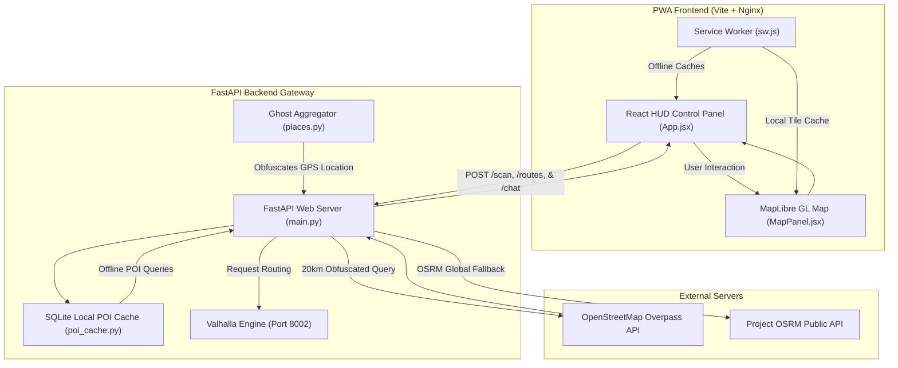

# BERGG Tactical Route Recon System

BERGG is a privacy-first, tactical, and offline-capable GPS navigation and reconnaissance console. It features a complete glassmorphic UI overhaul and provides unparalleled situational awareness by mapping active surveillance and local network telemetry onto dynamically calculated routes.

## Core System Architecture

---

## Technical Features

### 1. Hybrid Road-Following Routing
BERGG uses a hybrid routing module to ensure 100% reliable navigation:
* **Offline-First (Valhalla):** If navigating within the loaded offline tile bounds, the backend utilizes local **Valhalla** containers to calculate road paths.
* **Online Fallback (Project OSRM):** If you route out-of-bounds, the system automatically intercepts the error and routes the points to OSRM's global road API.
* **Visualization:** The map draws both the **Dashed Blue (Shortest)** and **Solid Red (Main Highway)** paths.

### 2. Tactical Glassmorphic HUD & Landing Experience
* The interface has been completely redesigned with a modern **Glassmorphic Aesthetic**. Translucent panels overlay the map viewport for a premium, uninterrupted tactical view.
* The system boots into a **Secure Terminal Landing Page** requiring explicit user initialization before dropping into the live operational HUD.

### 3. Dynamic Threat & Intel Extraction Along Routes
Unlike standard navigation software that only performs point-radius scans, BERGG actively sweeps the calculated routes for intelligence:
* **Wi-Fi Telemetry (Module A):** Cross-references local databases to extract and plot open Wi-Fi nodes occurring within a 150m radius of the active route path.
* **Surveillance Extraction (Module B):** Plots active CCTV cameras located along the route structure.
* **Dynamic POI Intent Filtering:** Fetches local amenities (Hospitals, Hotels, Picnic Areas, Fuel) centered around the route. The HUD **Intent Bar** allows operators to filter these points seamlessly alongside the generated path.

### 4. Floating AI Chat Assistant
* A floating glassmorphic **`[ 💬 AI ]`** trigger opens a compact chat terminal that floats above the interface.
* Queries the backend for tactical assistance, executing web searches via DuckDuckGo in a secure popout context.

### 5. Map Legend & Node Symbology
The operational map incorporates an explicit heads-up legend for rapid visual parsing:
* 🟢 **Neon Green** = Open Wi-Fi Node
* 🔴 **Red** = CCTV Surveillance Camera
* 🟡 **Yellow** = Selected Target

### 6. The Ghost Aggregator (Spatial Cloaking)
To protect user location privacy, when querying point-of-interest (POI) servers, the backend pings external OpenStreetMap Overpass servers with a **20-kilometer bounding box** instead of the user's exact coordinates. The backend filters out the exact requested region locally before passing it to the frontend.

---

## Installation & Running

### Windows (One-Click Launch)
Double-click the **`run.bat`** file in the root directory.
This script automatically:
1. Verifies/creates the `custom_files` directory.
2. Downloads the OSM PBF map tiles if missing.
3. Automatically sets up the backend configuration file (`.env`).
4. Compiles and starts all Docker containers (`docker-compose up --build -d`).

### Access Endpoints
* **Frontend Web HUD:** [http://localhost:3000](http://localhost:3000)
* **Backend API Gateway:** [http://localhost:8000](http://localhost:8000)
* **Valhalla Router:** [http://localhost:8002](http://localhost:8002)
